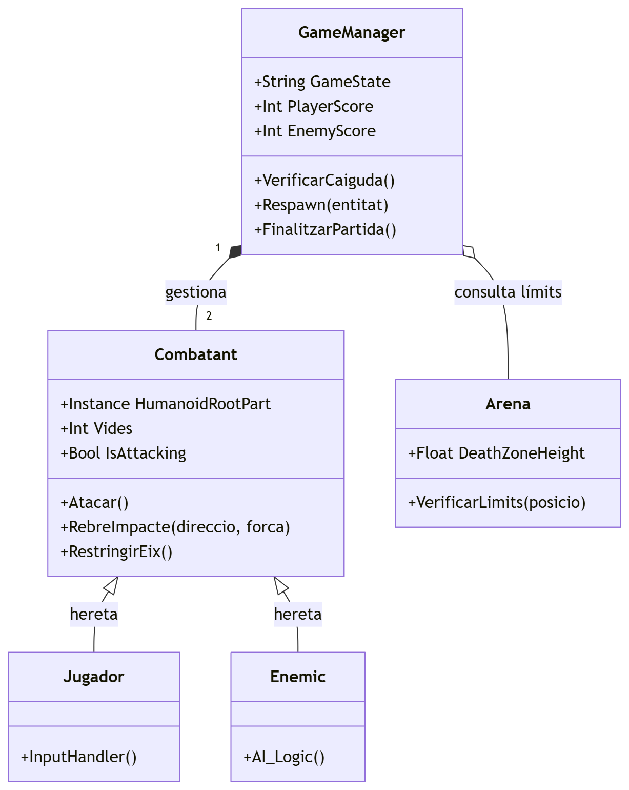
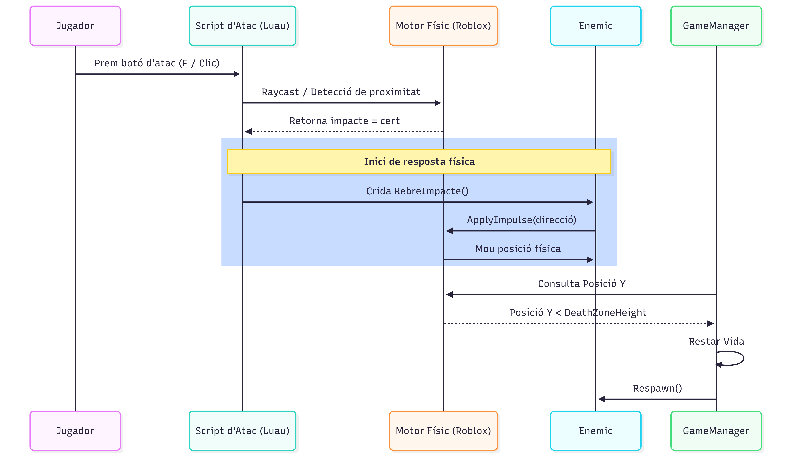

# Fase 2: Dissenya abans de programar

**Nom del fitxer:** Fase_2.md  
**Projecte:** Roblox Mini Brawl

---

## 1. Components principals del joc
El sistema es divideix en tres blocs funcionals:
* **Physics Engine (Roblox):** Gestió nativa de col·lisions i forces.
* **Game Loop Manager (Server):** Script que controla el recompte de vides i el respawn.
* **Controller System (Client/AI):** Mòduls que tradueixen els inputs (o la IA) en forces de moviment.

## 2. Entitats identificades
1.  **Combatant:** Classe base per a jugadors i NPCs (Humanoids).
2.  **GameManager:** Lògica central de la partida i estats.
3.  **Arena Manager:** Control de les zones de mort i els límits de l'escenari.

## 3. Atributs clau de cada entitat
* **Combatant:**
    * `Vides` (Int): Inicialment 3.
    * `PositionLock` (Vector3): Per mantenir l'eix Z fix.
    * `IsCooldown` (Bool): Per evitar atacs infinits.
* **GameManager:**
    * `MatchActive` (Bool): Estat de la partida.
    * `SpawnPoint` (CFrame): Punt de reaparició.

## 4. Accions, mètodes o funcions principals
* **Combatant:**
    * `Atacar()`: Detecta l'objectiu i aplica impuls.
    * `RebreImpacte(força)`: Executa `ApplyImpulse`.
    * `Reset()`: Torna a la plataforma i restaura estats.
* **GameManager:**
    * `CheckFall()`: Monitoritza si la posició Y és inferior al límit.
    * `UpdateUI()`: Envia senyals per actualitzar els punts a la pantalla.

## 5. Explicació del diagrama de classes
El diagrama utilitza una estructura de **composició**. El `GameManager` conté les referències als `Combatants`. S'ha triat així perquè la lògica de victòria/derrota ha de ser externa als personatges per poder reiniciar la partida sense dependre de si el personatge existeix o s'ha destruït.

## 6. Explicació del diagrama de comportament
S'ha optat per un **Diagrama d'Activitat** per representar el bucle principal:
`Inici -> Espera Input -> Atac -> Detecció -> Aplicar Física -> Comprovar Caiguda -> Restar Vida -> Respawn`.
Això reflecteix la naturalesa cíclica del joc i com el motor físic de Roblox s'intercala amb la nostra lògica.

## 7. Correspondència entre diagrames i codi futur
* Les entitats es programaran com a **ModuleScripts** dins de `ReplicatedStorage` per a un accés ràpid.
* El control de l'eix Z es farà mitjançant el servei `RunService` (Stepped) per garantir suavitat.
* La interfície d'usuari (vides) escoltarà canvis en atributs del GameManager.

## 8. Estructura inicial del repositori
L'estructura segueix l'estàndard professional de **Rojo**:
* `/src/server`: Lògica de vides i IA.
* `/src/client`: Input del jugador i càmera fixa.
* `/src/shared`: Atributs dels personatges i configuracions.
* `/diagrames`: Documentació visual del disseny.