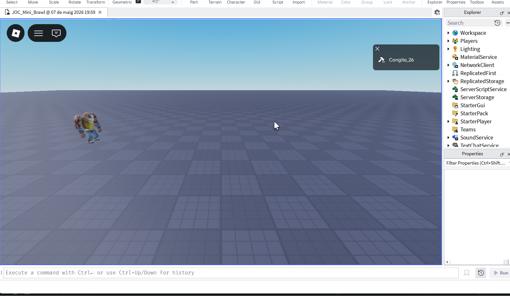

# Fase 3: Entorn i Prototip

## IDE i Configuració
He configurat **Visual Studio Code** amb l'extensió de **Rojo** per gestionar el codi de forma externa a Roblox Studio. Això em permet utilitzar **Git** per al control de versions.

## Decisions d'implementació
- **Càmera Scriptable:** He bloquejat la càmera en una posició fixa per donar una perspectiva lateral de joc de lluita.
- **Restricció d'eix:** He utilitzat `RunService.Heartbeat` per forçar la posició Z a 0, assegurant que el moviment sigui purament en 2D (lateral i vertical).

## Evidències visuals
