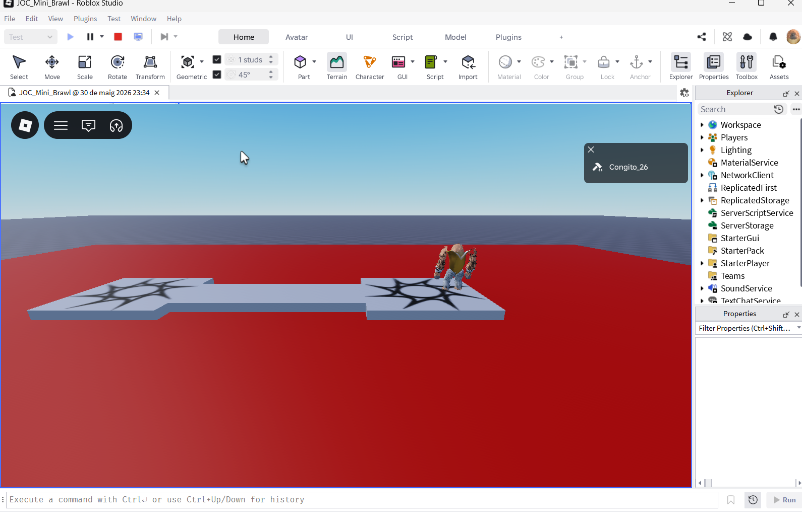
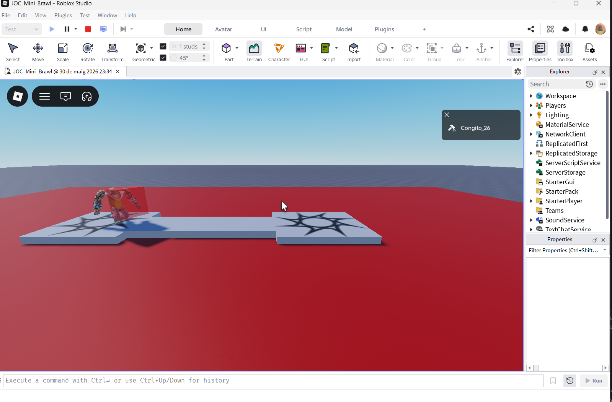
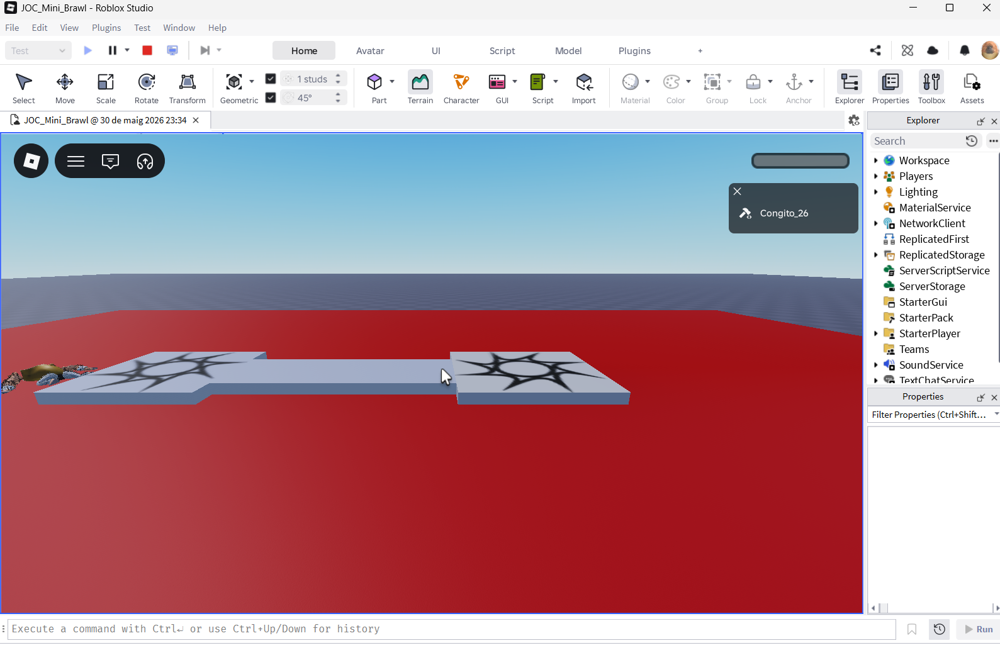

# Fase 4: Proves i Depuració - Joc Mini Brawl

Aquest document detalla les proves realitzades per validar les funcionalitats bàsiques del prototip, incloent la càmera 2D, el sistema de combat (hitbox), la restricció de moviment i la zona de mort.

## 1. Taula de Comprovacions (Checklist)

| ID | Funcionalitat | Acció de Prova | Resultat Esperat | Estat |
|:---|:---|:---|:---|:---:|
| CP-01 | **Càmera Scriptable** | Iniciar el joc | La càmera es fixa en una posició lateral sense moure's amb el ratolí. | ✅ Èxit |
| CP-02 | **Restricció 2D** | Intentar moure el personatge endavant/enrere | El personatge es manté sempre a l'eix Z=0. No pot sortir del "rail". | ✅ Èxit |
| CP-03 | **Zona de Mort** | Saltar fora de la plataforma cap a la zona vermella | En tocar la `KillPart`, la salut del personatge arriba a 0 i mor. | ✅ Èxit |
| CP-04 | **Sistema d'Atac** | Prémer la tecla **F** | Apareix una hitbox (cub vermell) davant del jugador per un breu moment. | ✅ Èxit |
| CP-05 | **Persistència post-mort** | Reaparèixer (Respawn) i moure's | La restricció 2D i l'atac tornen a funcionar correctament amb el nou personatge. | ✅ Èxit |

---

## 2. Evidències Visuals

### 2.1. Validació de la Càmera i Escenari
L'escenari està configurat amb els dos Spawns a les puntes i la KillPart vermella a sota.

### 2.2. Prova de la Hitbox (Atac)
Es confirma que el sistema de client detecta l'entrada del teclat i genera la part visual de l'atac.

### 2.3. Prova de la Zona de Mort
Evidència del moment en què el personatge entra en contacte amb la KillPart i s'activa el script de servidor.

---

### 1. Menú d'inici i Selecció de Dificultat
* **Descripció**: Interfície d'usuari on l'usuari tria la dificultat.
* **Evidència**: ![Menú de selecció]
* **Validació**: Sistema d'interacció amb el Client (UI) i parada de l'auto-inici del joc.

### 2. Sistema de Càrrega (Progress Bar)
* **Descripció**: Animació de la `ProgressBar` quan el joc es prepara.
* **Evidència**: ![Barra de progrés]
* **Validació**: Animació mitjançant `TweenService` i espera de l'usuari.

### 3. Comportament de l'NPC i Físiques
* **Descripció**: L'NPC seguint activament el jugador per la zona de combat.
* **Evidència**: ![NPC en moviment]
* **Validació**: Lògica `MoveTo` del servidor i gestió de col·lisions.

### 4. Sistema de Combat (Knockback)
* **Descripció**: Moment de l'impacte aplicant força a l'NPC amb la tecla 'F'.
* **Evidència**: ![Efecte knockback]
* **Validació**: Comunicació `RemoteEvent` (Client -> Servidor) i `LinearVelocity`.

### 5. Cicle de Reinici (GameOver)
* **Descripció**: Neteja del `Workspace` i reactivació del menú després d'una mort.
* **Evidència**: ![Reset del joc]

* **Validació**: Estabilitat del cicle `GameOver()` i reactivació de la interfície.
---

## 3. Registre d'Incidències i Solucions

| Incidència | Causa Arrel | Solució Aplicada |
|:---|:---|:---|
| El personatge apareixia al buit. | El `SpawnLocation` tenia una coordenada Z diferent de 0. | Es va ajustar la Posició Z a 0 a les Propietats de Studio. |
| La lògica 2D fallava en morir. | L'script perdia la referència al `HumanoidRootPart` del nou cos. | Es va implementar l'esdeveniment `CharacterAdded` per reiniciar la lògica. |
| Rojo no sincronitzava els canvis. | Versió de Rojo Server (7.7.0) diferent a la del Plugin (7.6.1). | Es va descarregar la versió 7.6.1 de Rojo per garantir compatibilitat. |

---

## 4. Conclusions de la Fase
El prototip és funcional i estable. S'han validat els pilars mecànics del joc (Moviment 2D, Mort i Atac). El sistema està preparat per a la implementació de la interfície d'usuari (UI) i la lògica de combat avançada en les següents fases.